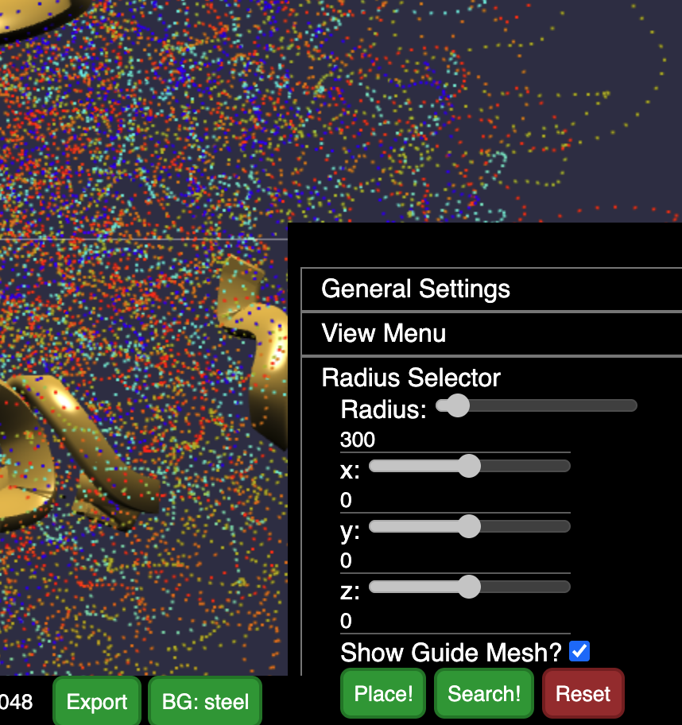

# Tutorial

## GEMINI apps

- [https://gemini-pollux.vercel.app/](https://gemini-pollux.vercel.app/)
- [https://gemini-castor.vercel.app/](https://gemini-castor.vercel.app/)

**GEMINI follow-along hands-on workshop**

**open this URL :**

- [https://gemini-pollux.vercel.app/](https://gemini-pollux.vercel.app/)

From the start screen that you see, there are 3 steps to start using GEMINI

1. Load data from embedded WashU Epigenome Browser (through a datahub)
2. Select what tracks to use in GEMINI from the datahub
3. Load 3D model raw coordinates
4. Render the model

### Steps in detail :

1. Copy the datahub example link that has _4 BigWig, 1 HiC_
2. Click on **Browser View** on the top nav bar
3. Pick `hg19`
4. Tracks → Custom Tracks → Add Custom Datahub

   

5. Paste the URL and add all the tracks
6. Navigate back to **Home** and copy _Test View Region_

   

7. Paste the view region in Browser View and load for the browser to complete loading data for all tracks
8. Navigate to **Track Selection**
9. You should see a list of the tracks that were loaded through the datahub
10. Select All
11. Navigate to **Input structure Data**

    > Copy the default structure example data and wait for the structure to complete loading

    

12. Navigate to **3D View**
13. Hit the green **Render** on the top right of nav bar

You should see a view like this:

---

### SELECTORS or 3D Space Queries

We will start with a basic type of space selector called **Radius Selector**

On the menu on the right, click on **Radius Selector**

### Multiple Radius Selector = Base pair series

Let's build upon the previous feature. Say we want to perform this selection, but across a set of spatial points.

Specifically, let's say there is a list of Chromosome Intervals, and we want to locate them in the 3D space, and scoop out a spherical region around those points, with a flexible radius.

Navigate to **Home** page and copy _Test BPS Segments_

Click on Sort History tab on the console to see the search results, that can be downloaded as a JSON file

### Save To Genome

Let's save the current chromosome model into the genome level space by clicking the Save To Genome Button.

The result is the transposed chromosome model in the genome level space.

### Genome Base Pair Selector

We will now render a view region in chromosome 8 by repeating the rendering process above, and clicking Save To Genome in that model.

Genome View should have both chromosome 7 and 8 rendered as a result.

Input a string of view region segments like in the chromosome level base pair selector, except the string inputted here can contain segments from multiple chromosomes. This will be the result.

**Features**

- Browser - load data
- smaller region - `chr7:21874114-32553048`
- Track Selection
- Input Data structure
- Render
- Radius Selection
- BPS
- Download the Search result
- Save to Genome
- Bigger Region with arc view - `chr7:103212734-124515672`
- Preserve Selection - Union
- Conform Selection - Intersection
- Volume Selection
- Radius Selection
- Section Selection
- Gene Search
- Abstraction - Hide and show
- Console
- Add annotation
- Radius highlight
- Volume highlight
- Export
- Open in Castor
- Save View Recall
- Live Session

## Export model
