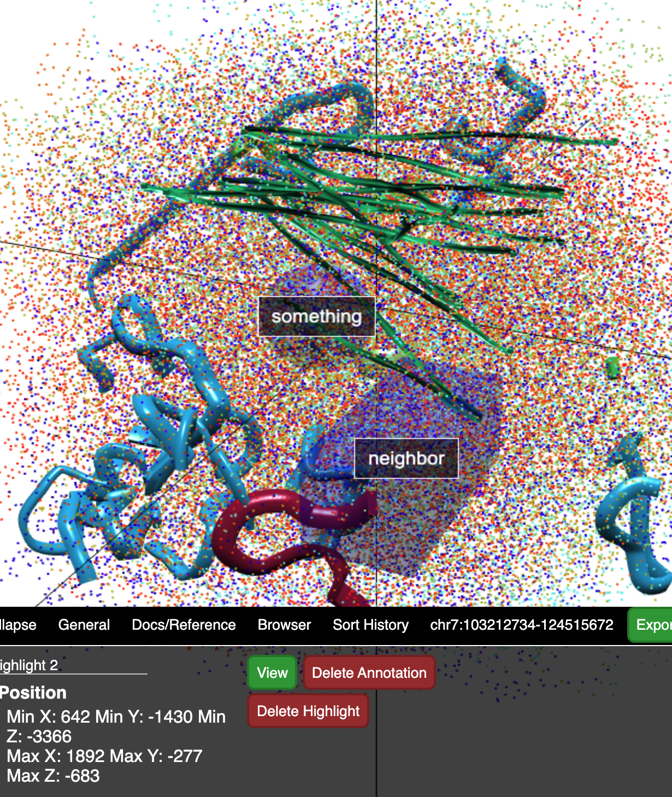

# Tutorial

**GEMINI follow-along hands-on workshop**

**open this URL :**

[https://gemini-dpuru-debugpoint136.vercel.app/](https://gemini-dpuru-debugpoint136.vercel.app/)

From the start screen that you see, there are 3 steps to start using GEMINI

1. Load data from embedded WashU Epigenome Browser (through a datahub)
2. Select what tracks to use in GEMINI from the datahub
3. Load 3D model raw coordinates
4. Render the model

### Steps in detail :

1. Copy the datahub example link that has _4 BigWig, 1 HiC_
2. Click on **Browser View** on the top nav bar
3. Pick `hg38`
4. Tracks → Custom Tracks → Add Custom Datahub
5. Paste the URL and add all the tracks
6. Navigate back to **Home** and copy _Test View Region_
7. Paste the view region in Browser View and load for the browser to complete loading data for all tracks
8. Navigate to **Track Selection**
9. You should see a list of the tracks that were loaded through the datahub
10. Select All
11. Navigate to **Input structure Data**
12. Copy the default structure example data and wait for the structure to complete loading
13. Navigate to **3D View**
14. Hit the green **Render** on the top right of nav bar

---

**Features**

- Browser - load data
- smaller region - `chr7:21874114-32553048`
- Track Selection
- Input Data structure
- Render
- Radius Selection
- BPS
- Download the Search result
- Save to Genome
- Bigger Region with arc view - `chr7:103212734-124515672`
- Preserve Selection - Union
- Conform Selection - Intersection
- Volume Selection
- Radius Selection
- Section Selection
- Gene Search
- Abstraction - Hide and show
- Console
- Add annotation
- Radius highlight
- Volume highlight
- Export
- Open in Castor
- Save View Recall
- Live Session

## Export model
